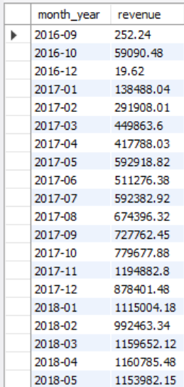
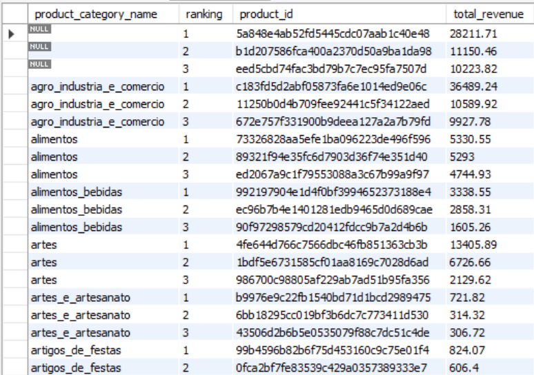
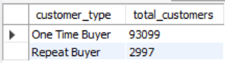

# Olist SQL Mini Capstone

A SQL data analysis project using the **Olist Brazilian E-commerce Dataset**, completed as part of the **DataSense Analytics Data Camp**.

## About the Project

This project answers eight business questions using SQL to analyze customer behavior, revenue trends, product performance, and purchasing patterns.

## Tools Used

* MySQL
* SQL
* GitHub

## Tech Stack

| Tool   | Purpose                                    |
| ------ | ------------------------------------------ |
| MySQL  | Data querying and analysis                 |
| SQL    | Data extraction and transformation         |
| GitHub | Project version control and portfolio      |
| Excel  | Data cleaning and dashboarding (DataSense) |

## SQL Skills Demonstrated

* INNER JOIN
* GROUP BY
* Aggregate Functions (`SUM`, `COUNT`)
* Common Table Expressions (CTEs)
* Window Functions (`LAG`, `ROW_NUMBER`, `SUM OVER`)
* CASE WHEN
* DATE_FORMAT

## Business Questions

* Top 10 customers by total amount spent.
* Monthly revenue trend.
* Month-over-month revenue growth.
* Highest revenue-generating product categories.
* Top 3 products within each category.
* Customer spend segmentation.
* Repeat buyers vs one-time buyers.
* Revenue contribution by top product category.

## 📸 Sample Query Outputs

### Q2 — Monthly Revenue Trend

---

### Q5 — Top 3 Products Within Each Category

---

### Q7 — Repeat vs One-Time Buyers

## Repository Structure

* `sql_queries/` — SQL solutions for each question.
* `screenshots/` — Query output screenshots.
* `insights/` — Business insights and recommendations.

## Author

**Ian Yesdalawampu**

Chemical Engineer transitioning into Data Analytics through DataSense Analytics Data Camp.
